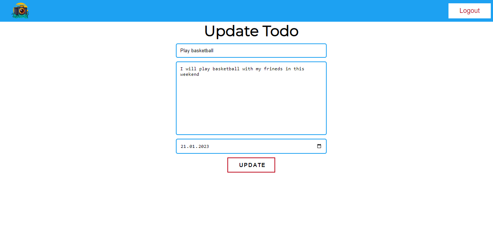

# Todo Express App With Passport Authentication

Full Stack Todo app with passport authentication and custom forget password

## Preview Site





# Getting started

## Running locally

To get the Node server running locally:

- Clone this repo
- `npm install` to install all required dependencies
- Create .env file and specified these:

```bash
PORT = <any port>
MONGO_URL = <your local or cloud mongodb url>
SESSION_SECRET = <your session secret phrase>
MAIL_CLIENT_ID = <your mail client id>
MAIL_CLIENT_SECRET = <your mail client name>
MAIL_REFRESH_TOKEN = <refresh token get oauth playground>
SENDER_EMAIL_ADDRESS = <your email address >
RESET_PASSWORD_URL = <http://localhost:${PORT}/auth/reset>
```
- Lastly npm start and go http://localhost:${PORT}>


# Code Overview

## Dependinces

- [expressjs](https://github.com/expressjs/express) - The server for handling and routing HTTP requests
- [connect-flash](https://www.npmjs.com/package/connect-flash) - For custom messages show user
- [mongoose](https://github.com/Automattic/mongoose) - For modeling and mapping MongoDB data to javascript 
- [ejs](https://ejs.co/) - For custom html template
- [express-session](https://www.npmjs.com/package/express-session) - For handling user sessions and cookies
- [express-validator](https://express-validator.github.io/docs) - For custom form validation
- [method-override](https://www.npmjs.com/package/method-override) - For handling custom put,delete,etc. requests
- [nodemailer](https://nodemailer.com/about/) - For send email for change password handling
- [google-auth-library](https://cloud.google.com/nodejs/docs/reference/google-auth-library/latest) - For send email with gmail
- [passport passport-local passport-local-mongoose](https://www.passportjs.org/docs/) - For handling authenticaton


## Application Structure

- `config/` - This folder contains configuration for database and sending email.
- `index.js` - The entry point to our application. This file defines our express server and connects it to MongoDB using mongoose. It also requires the routes and models we'll be using in the application.
- `controllers/` - This folder contains the function definitions for our API.
- `models/` - This folder contains the schema definitions for our Mongoose models.
- `public/` - This folder contains the static javascript,css and images.
- `routes/` - This folder contains the route definitions for our API.
- `utils/` - This folder contains custom function definitions for our API.
- `views/` - This folder contains ejs files.

## Authentication

Requests are authenticated using the custom third party package(passport).we used register-login and logout function in `controllers/auth.js` file.

## Other Features

### Send email

We used nodemailer for custom send email.We used also google-auth-library for sending mail with gmail.We defined custom configuraton in `config/sendmail.js` file.After define custom configuration file, we sent custom message for change password in `controllers/auth.js` file.  

### Forget Password

We generated custom token with crypto and sent to user with email.After User click email, we checked token.If a valid token we deleted old user and created new user with old email,username and new password. All of this configurated in `controllers/auth.js` file.  

## Copyright and License

Copyright 2023 [Enes Uraz](https://github.com/greatAlhazen). 
